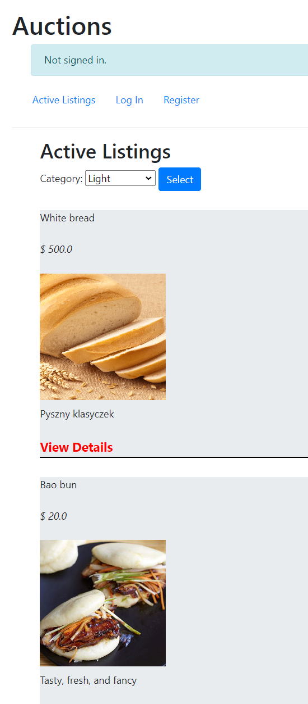

# Commerce
Commerce is a simple app with functionalities of creating listings, bidding and accepting offers.

To run app type in console (you need django and pillow installed):
'python manage.py runserver'

Images:

